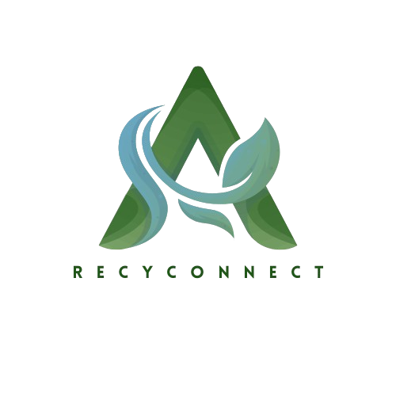

#  RecyConnect – Application Java de gestion du recyclage


**RecyConnect** est une application Java/JavaFX axée sur le développement durable et l’intelligence artificielle (IA). Elle vise à faciliter les échanges entre producteurs de déchets (supermarchés, restaurants, particuliers) et les entités de valorisation (usines, associations, citoyens engagés). Le projet s’inscrit pleinement dans une démarche éco-responsable et contribue aux Objectifs de Développement Durable (ODD).

---
## 🎯 Objectifs de Développement Durable (ODD)

RecyConnect s’inscrit pleinement dans une démarche éco-responsable en répondant à plusieurs **Objectifs de Développement Durable (ODD)** définis par les Nations Unies :

<table>
  <tr>
    <td align="center">
      <br/>
      <strong>ODD 8</strong><br/>
      Travail décent et croissance économique
    </td>
    <td align="center">
      <br/>
      <strong>ODD 11</strong><br/>
      Villes et communautés durables
    </td>
    <td align="center">
      <br/>
      <strong>ODD 12</strong><br/>
      Consommation et production responsables
    </td>
    <td align="center">
      <br/>
      <strong>ODD 13</strong><br/>
      Lutte contre le changement climatique
    </td>
  </tr>
</table>

## ✨ Fonctionnalités principales

- 🔐 **Gestion des utilisateurs**
  - Création de compte avec reconnaissance faciale
  - Authentification sécurisée
  - Activation/désactivation de comptes par l'administrateur

- 📦 **Gestion des articles**
  - Ajout, modification, suppression et catégorisation des articles
  - Modération des images avec API Sightengine
  - Notification par email en cas de refus

- 🛒 **Gestion des commandes**
  - Ajout au panier, modification des quantités, suppression
  - Paiement via Paymee ou à la livraison
  - Génération de factures PDF

- 📝 **Gestion des posts (Forum)**
  - Création de publications avec médias
  - Filtrage par tags
  - Likes, commentaires, réponses imbriquées
  - Validation de contenu avec Gemini API

- 📆 **Gestion des événements**
  - Création, modification et suppression d'événements (en ligne ou sur site)
  - Intégration avec Jitsi Meet pour les visioconférences
  - Affichage de la carte avec Leaflet et géolocalisation via Nominatim

- 🧪 **Gestion des workshops**
  - Ajout, modification, suppression de workshops
  - Attribution de notes (1 à 5), filtrage, affichage des moyennes
  - Statistiques par catégorie, chatbot intégré, vidéo explicative
  - Génération automatique de description via analyse vidéo (IA)

---

## 🧰 Technologies utilisées

### 👨‍💻 Backend & Frontend
- **Java 17**
- **JavaFX** – Interface utilisateur
- **JDBC** – Connexion base de données
- **MySQL** – Stockage des données

### 🔌 APIs & Intégrations externes
- **[Face++ API](https://www.faceplusplus.com/)** – Reconnaissance faciale
- **[Paymee](https://sandbox.paymee.tn/)** – Paiement sécurisé
- **[Sightengine](https://sightengine.com/)** – Détection de contenu inapproprié
- **[Mailer API](https://www.mailersend.com/)** – Notification par email
- **[Gemini API (Google)](https://deepmind.google/technologies/gemini/)** – Analyse sémantique des contenus
- **[Leaflet](https://leafletjs.com/)** – Cartographie interactive
- **[MapTiler Cloud](https://www.maptiler.com/cloud/)** – Amélioration des cartes
- **[Jitsi Meet](https://jitsi.org/)** – Génération de visioconférences

### 🧠 Intelligence Artificielle & IA appliquée
- **Gemini API (Google)** – Analyse sémantique, validation de contenu
- **Analyse vidéo par IA** – Génération automatique de résumés pour les workshops

---

## 🏁 Lancement du projet

1. **Cloner le dépôt**
   ```bash
   git clone https://github.com/ZeinebNsiri/RecyConnect_JAVA.git
   ```

---

## 📚 Projet académique

Ce projet a été réalisé dans le cadre d’un projet académique à l’école d’ingénierie **ESPRIT** (École Supérieure Privée d'Ingénierie et de Technologies), démontrant la capacité à intégrer des technologies avancées telles que **JavaFX**, des **API d’IA** et des outils de **développement durable** dans une solution complète.

---

## 👥 Équipe projet – TechSquad

Ce projet a été réalisé dans le cadre d’un projet académique à l’école **ESPRIT**, par un groupe de 6 étudiantes en ingénierie informatique, passionnées par l’innovation durable et l’intelligence artificielle.

**Membres de l'équipe : TechSquad**
- Sahar Mnif  
- Zeineb Nsiri  
- Mohamed Aziz Zouari
- Samar Touil
- Amal Eljazi
- Eya Guirat

Nous avons collaboré sur toutes les étapes du projet : conception, développement, intégration d'API et documentation. Ce travail reflète notre engagement pour un avenir plus vert et plus intelligent 🌍🤖.

